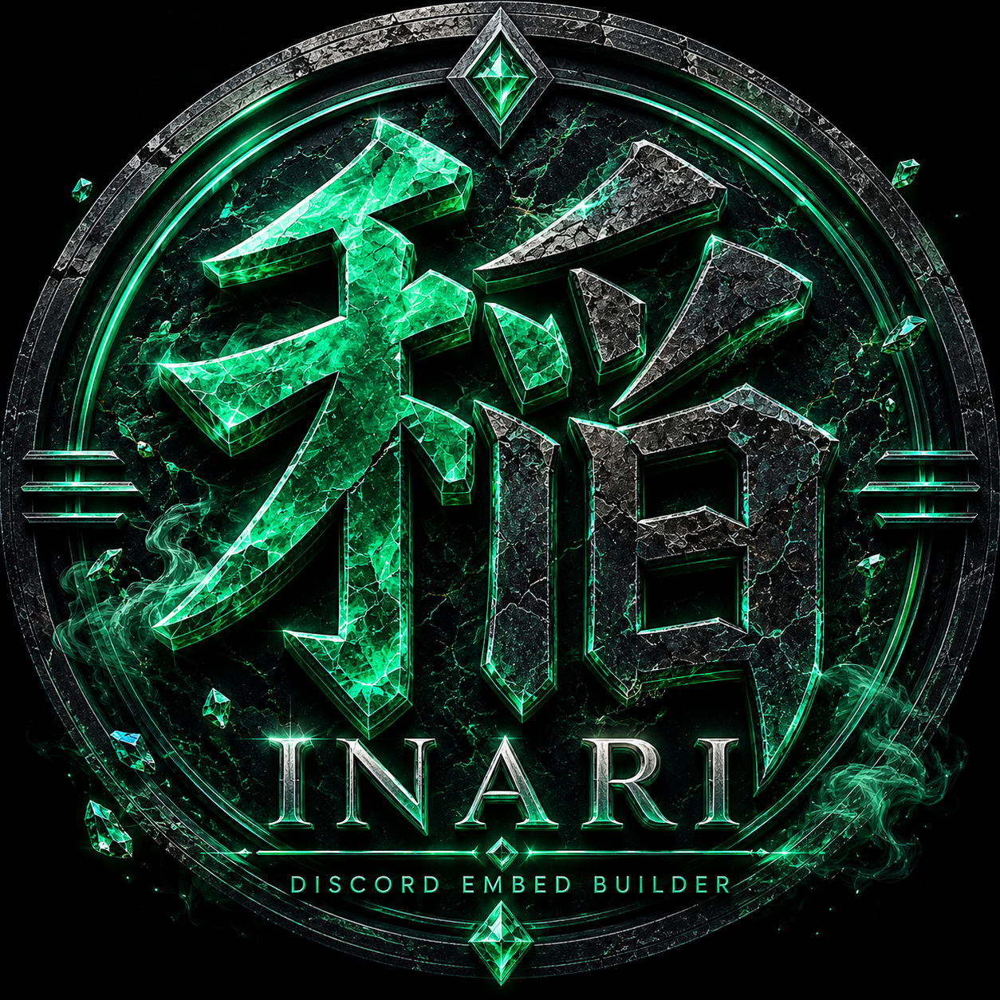

<div align="center">



# 稲 ¦ Inari

### Discord Embed Builder & Dashboard

*Build. Preview. Perfect.*

---


</div>

---

## ✦ Overview

Inari is a self-hosted Discord embed builder with a live web dashboard. Design rich embeds visually, preview them in an accurate Discord replica, and send them directly to any channel — all without touching a single line of code.

---

## ✦ Features

- **✦ Live Preview** — Accurate Discord embed rendering updates as you type, with Dark, Light, and AMOLED theme support
- **✦ Full Embed Control** — Title, description, author, footer, fields, thumbnail, image, color, and timestamp
- **✦ Code Block Inserter** — One-click code block with language selector (js, py, ts, bash, json, and more)
- **✦ Emoji Picker** — Loads your real server emojis with animated GIF support and one-click insert
- **✦ JSON Import / Export** — Paste any Discord embed JSON to load it, or export your current embed
- **✦ Templates** — Save named embed presets and reload them in one click
- **✦ Vault** — Store image URLs with live previews organized by Profiles, Thumbnails, and Images
- **✦ Desktop / Mobile Preview** — Toggle viewport to catch layout issues before sending
- **✦ Direct Send** — Select server and channel from the dashboard and send instantly
- **✦ Persistent Storage** — Templates and Vault survive restarts via SQLite

---

## ✦ Dashboard

- **✦ Obsidian × Jade Theme** — Premium dark UI with jade/emerald accents
- **✦ Builder** — Full embed editor with live Discord preview
- **✦ Templates** — Save, load, and manage reusable embed designs
- **✦ Vault** — Image URL library with visual preview cards
- **✦ History** — Coming soon
- **✦ Settings** — Coming soon

---

## ✦ Tech Stack

| Layer      | Tool                  |
| ---------- | --------------------- |
| Runtime    | Node.js LTS           |
| Bot        | Discord.js v14        |
| Dashboard  | React 19 + Vite 6     |
| Styling    | Tailwind CSS v4       |
| Storage    | SQLite (better-sqlite3) |
| API        | Express.js v5         |
| Hosting    | Docker + nginx        |
| Editor     | Visual Studio Code    |

---

## ✦ Setup

### Prerequisites

- Node.js 18+
- Docker Desktop
- A Discord bot token

### 1. Clone the repo

```bash
git clone https://github.com/Takumi-Labs-Dev/Inari.git
cd Inari
```

### 2. Create your `.env` file

```env
# Bot
DISCORD_TOKEN=your_bot_token_here
DISCORD_CLIENT_ID=your_application_id_here
DISCORD_GUILD_ID=your_test_server_id_here

# API
API_PORT=3003

# Dashboard
VITE_API_URL=http://localhost:3003
```

### 3. Start with Docker

```bash
docker compose up --build
```

### 4. Open the dashboard
http://localhost

### 5. Verify the bot API
http://localhost:3003

---

## ✦ How It Works
Open dashboard → Design embed visually
↓
Live preview updates in real time
↓
Select server + channel
↓
Click Send
↓
Inari bot delivers embed to Discord

---

## ✦ Project Structure
inari/
├── bot/                  # Discord bot + REST API
│   ├── src/
│   │   ├── index.js      # Bot entry point
│   │   ├── db.js         # SQLite setup
│   │   └── routes/
│   │       └── api.js    # Express API routes
│   └── Dockerfile
│
├── dashboard/            # React web dashboard
│   ├── src/
│   │   ├── components/   # Editor, preview, layout
│   │   ├── pages/        # Builder, Templates, Vault
│   │   ├── store/        # Zustand state
│   │   └── api/          # API client
│   └── Dockerfile
│
├── docker-compose.yml
└── .env

---

## ✦ System Highlights

| Feature          | Description                                      |
| ---------------- | ------------------------------------------------ |
| Live Preview     | Accurate Discord embed replica with theme toggle |
| Vault            | Image URL library with proxy-free previews       |
| Templates        | SQLite-backed named embed presets                |
| Emoji Picker     | Real server emojis including animated GIFs       |
| Direct Send      | Send to any channel without leaving the UI       |
| Zero Config Send | No bot commands needed — pure dashboard control  |

---

## ✦ Version

**Current Version:** `0.1.0-beta`.

---

## ✦ License

Private — All rights reserved © Takumi Labs
